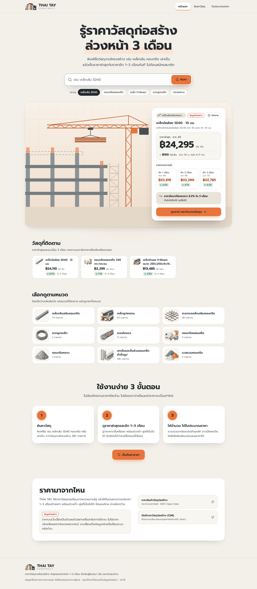
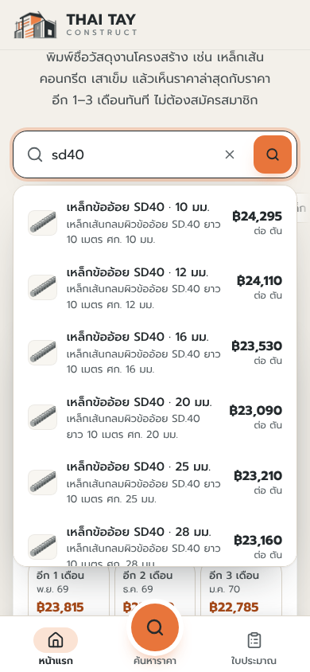
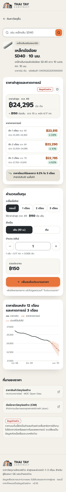
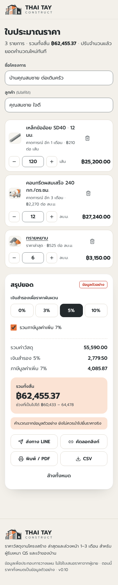
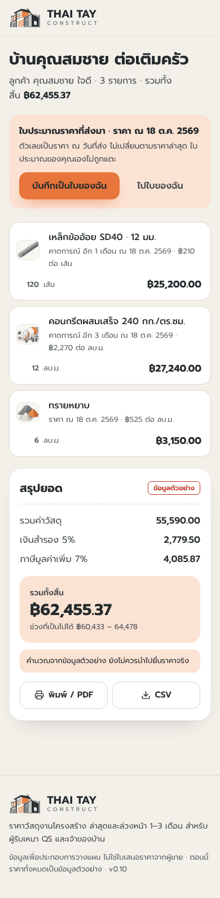

<p align="center"></p>

# THAI TAY

**รู้ราคาวัสดุก่อสร้างล่วงหน้า 3 เดือน**

พิมพ์ชื่อวัสดุงานโครงสร้าง เช่น เหล็กเส้น SD40 หรือคอนกรีตผสมเสร็จ แล้วเห็นราคาล่าสุดกับราคาคาดการณ์อีก 1–3 เดือนทันที ใส่จำนวนแล้วได้ใบประมาณราคาที่พิมพ์ บันทึกเป็น PDF หรือส่งทาง LINE ได้

เว็บที่ deploy อยู่: https://thaitay.vercel.app

> **สถานะ:** หน้าเว็บแสดงราคาจริงจาก สนค. พร้อมราคาคาดการณ์ 1–3 เดือน (Naive) ช่วงราคาต่ำ–สูง และป้าย "ราคามีโอกาสเปลี่ยน" (LightGBM) ราคาอัปเดตเดือนละครั้งหลัง สนค. ประกาศ ข้อมูลเป็นไฟล์ JSON ในเว็บเอง จึงไม่ต้องมี backend ผลการทดลองทั้งหมดอยู่ใน [`ml/DATA_REVIEW.md`](ml/DATA_REVIEW.md) และ notebook [`ml/colab/THAITAY_ML.ipynb`](ml/colab/THAITAY_ML.ipynb)



## ภาพหน้าจอ

ถ่ายจาก build v0.10 ที่ความกว้าง 390 px (ตอนนั้นยังเป็นราคาตัวอย่าง)

| ค้นหาจากหน้าแรก | หน้าวัสดุ | ใบประมาณราคา | ใบที่คนเปิดลิงก์เห็น |
| :---: | :---: | :---: | :---: |
|  |  |  |  |

ภาพจอใหญ่และไฟล์ PDF ตัวอย่างอยู่ใน [`docs/screenshots/`](docs/screenshots)

## ใช้ทำอะไรได้

- **ค้นหาวัสดุ** ที่ สนค. ยังเก็บราคา 183 รายการ (จากแคตตาล็อก 287 รายการ) ในหมวดงานโครงสร้าง ช่องค้นหาเข้าใจคำหน้างาน เช่น "sd40" เจอ "SD.40", "ปูน", "ไวร์เมช", "เอชบีม", "4 หุน" และ "DB12"
- **ดูราคาและแนวโน้ม** หน้าวัสดุแสดงราคาล่าสุด ราคาคาดการณ์ 1–3 เดือนพร้อมช่วงต่ำ–สูง กราฟย้อนหลัง 12 เดือน และคำแนะนำว่าควรซื้อตอนนี้หรือรอ
- **เหล็กเส้นคิดเป็นเส้นได้** ร้านขายเป็นตันแต่หน้างานนับเป็นเส้น เว็บแปลงให้จากน้ำหนักมาตรฐาน 0.00617 × ศก.² กก./ม.
- **ใบประมาณราคา** ใส่ชื่อโครงการ ลูกค้า จำนวน เงินสำรอง และ VAT 7% แล้วพิมพ์เป็นใบเสนอราคา ดาวน์โหลด CSV หรือส่งลิงก์ทาง LINE ลิงก์เก็บรายการและราคา ณ วันที่ส่งไว้ในตัว จึงไม่ต้องมีเซิร์ฟเวอร์
- **ติดตามวัสดุ** กดดาวแล้ววัสดุนั้นขึ้นที่หน้าแรกพร้อมแนวโน้มราคา 3 เดือน
- **มือถือก่อน** แถบล่าง 3 ปุ่ม และไม่มีส่วนไหนล้นจอตั้งแต่ 320 px

### หมวดวัสดุ

เหล็กเส้นเสริมคอนกรีต · เหล็กรูปพรรณ · ตะแกรงเหล็กเสริมคอนกรีต · ลวดผูกเหล็ก · ลวดอัดแรง · คอนกรีตผสมเสร็จ · คอนกรีตหยาบ · เสาเข็มและชิ้นส่วนคอนกรีตสำเร็จรูป · มวลรวมคอนกรีต

งานสถาปัตยกรรม งานก่อผนัง สุขาภิบาล และไฟฟ้า อยู่นอกขอบเขต

## ข้อมูลราคามาจากไหน

รหัสวัสดุใช้รหัสสินค้า 16 หลักของกระทรวงพาณิชย์ (`MAT-…`) ลิงก์แหล่งราคาบนเว็บตั้งไว้ที่ `frontend/src/config/sources.ts`

| แหล่ง | หน่วยงาน | ใช้ทำอะไร |
|---|---|---|
| [ราคาวัสดุก่อสร้าง](https://index.tpso.go.th/construction-material-prices/prices-building-materials) | สนค. กระทรวงพาณิชย์ | ราคาหลักของเว็บ: ราคารายสินค้า รายเดือน ใช้ฝึกโมเดล |
| [ดัชนีราคาวัสดุก่อสร้าง (CMI)](https://www.tpso.go.th/economic-data/construction-materials-price-index) | สนค. | ตรวจแนวโน้มภาพรวม |
| ปัจจัยภายนอก | Yahoo Finance, ปตท. | น้ำมัน Brent แร่เหล็ก ค่าเงินบาท และราคาดีเซล ใช้กับป้าย "ราคามีโอกาสเปลี่ยน" (`ml/fetch_factors.py`) |

## อัปเดตราคารายเดือน

`ml/monthly_update.sh` ทำครบทุกขั้นในคำสั่งเดียว: ดึงราคาใหม่จาก สนค. ดึงปัจจัยภายนอก คำนวณราคาคาดการณ์ ช่วงราคา และป้าย แล้วเขียนไฟล์ JSON ของเว็บ พร้อมสอบคำทายเดือนก่อนกับราคาจริง ตั้งให้รันเองทุกวันที่ 10 ของเดือน แล้วเปิด PR ให้ตรวจก่อน merge เมื่อ merge เข้า `main` แล้ว Vercel deploy เอง วิธีรันเองอยู่ใน [`ml/README.md`](ml/README.md)

## งานที่ยังเหลือ

1. **แหล่งข้อมูลที่ยังขาด** ราคาถ่านหิน เศษเหล็ก และเหล็กฟิวเจอร์ส ตอนนี้ใช้ค่าเดือน ก.ย. 2569 ไปก่อน ถ้าหาแหล่งไม่ได้ภายในราว 3 เดือน ให้ฝึกป้ายใหม่โดยไม่ใช้ 3 ตัวนี้
2. **โมเดลที่แม่นกว่า naive** ทดลองแล้ว 16 แบบ (LightGBM, Random Forest, LSTM, Linear, ETS และอื่น ๆ) ยังไม่มีแบบไหนชนะ naive ได้ทั้งช่วงทดสอบย้อนหลัง 7 ปีและ 12 เดือนล่าสุด ขั้นต่อไปคือหาข้อมูลที่รู้ก่อน สนค. ประกาศ เช่น ราคาโรงงานเหล็กรายสัปดาห์ และรัน LightGBM คู่กับ naive ทุกเดือน
3. **backend (ทางเลือก)** ถ้าวันหนึ่งต้องคำนวณราคาสด ใช้ `ml/serve.py` บน Cloud Run แล้วตั้ง `VITE_API_BASE` (ดู `ml/README.md` หัวข้อ "ทางเลือก: backend")

## เทคโนโลยี

| ส่วน | ที่ใช้ |
|---|---|
| Frontend | React 18, Vite 6, TypeScript, Tailwind CSS 4, shadcn/ui, Recharts |
| ข้อมูลและโมเดล | Python, pandas, statsmodels, LightGBM, scikit-learn |
| ข้อมูลบนเว็บ | ไฟล์ JSON ใน `frontend/public/data/prices/` (มี FastAPI `ml/serve.py` สำรองไว้) |
| Deploy | Vercel |

## รันในเครื่อง

ต้องมี Node.js 22.13 ขึ้นไป

```bash
cd frontend
npm ci
npm run dev        # เปิด URL ที่ Vite แสดง
npm run build      # ตรวจ TypeScript แล้ว build
npm run preview
```

ถ้าหน้าเว็บขาวและ console แจ้ง 404 ของไฟล์ `index-*.js` แปลว่า `base` ไม่ตรงกับ path ที่โฮสต์ ดูตารางหัวข้อ Deploy ใน [`frontend/README.md`](frontend/README.md)

## โครงสร้างโปรเจกต์

```text
THAITAY/
├── frontend/                 เว็บ (React + Vite)
│   ├── src/pages/            หน้าแรก ค้นหา หน้าวัสดุ ใบประมาณราคา
│   ├── src/services/         อ่านราคาจากไฟล์ JSON (หรือจาก API เมื่อตั้ง VITE_API_BASE)
│   ├── src/data/             รายชื่อวัสดุ 287 รายการ และรายการที่ สนค. เลิกเก็บราคา
│   ├── public/data/prices/   ราคาจริงและราคาคาดการณ์ของแต่ละวัสดุ (สร้างจาก ml/)
│   ├── README.md             รายละเอียดทุกไฟล์และวิธี deploy
│   ├── PRODUCT.md            ผู้ใช้ เป้าหมาย และหลักการของผลิตภัณฑ์
│   └── DESIGN.md             สี ตัวอักษร และ component
├── ml/                       ดึงราคา ทดลองโมเดล และอัปเดตรายเดือน (คู่มือใน ml/README.md)
│   ├── monthly_update.sh     อัปเดตราคาเดือนใหม่ครบทุกขั้น
│   ├── DATA_REVIEW.md        ผลการทดลองทั้งหมด
│   └── colab/                notebook อธิบายทุกขั้นตอน
├── docs/
│   ├── CHANGELOG.md          สิ่งที่เปลี่ยนในแต่ละเวอร์ชัน
│   └── screenshots/          ภาพหน้าจอและผลตรวจ v0.10
└── README.md
```

## การตรวจสอบ

ผลตรวจ v0.10 อยู่ใน [`docs/screenshots/verification.md`](docs/screenshots/verification.md): `npm run build` ผ่าน, ทดสอบในเบราว์เซอร์ที่จอ 1440 และ 390 px ผ่าน 51 ข้อ, ไม่มีส่วนไหนล้นจอที่ 320 ถึง 1440 px และสีตัวหนังสือทุกคู่ผ่าน WCAG AA
